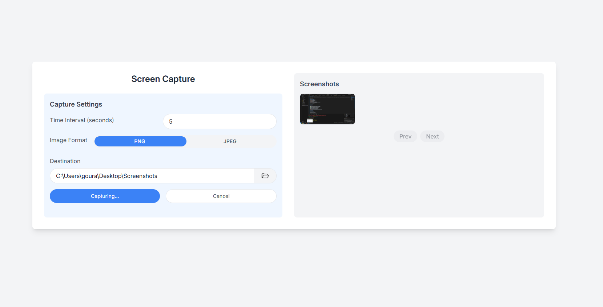
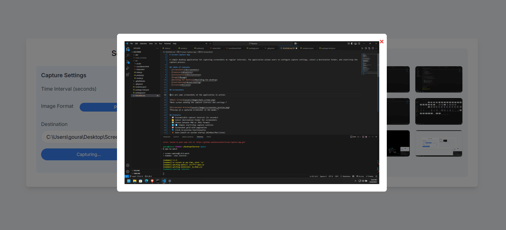

# Screen Capture App

A simple desktop application for capturing screenshots at regular intervals. The application allows users to configure capture settings, select a destination folder, and start/stop the capture process.

## Table of Contents
- [Screenshots](#screenshots)
- [Features](#features)
- [Installation](#installation)
- [Usage](#usage)
- [Building for Desktop](#building-for-desktop)
- [Contributing](#contributing)
- [License](#license)

## Screenshots

Here are some screenshots of the application in action:


*Main screen showing the capture controls and settings.*


*Preview of a captured screenshot in the modal.*

## Features
- 🕒 Customizable capture interval (in seconds)
- 📁 Select destination folder for screenshots
- 🖼️ Choose between PNG or JPEG formats
- ▶️/⏹️ Simple start/stop capture controls
- 🎨 Screenshot grid with pagination
- 🔍 Click-to-preview functionality
- ⚡ Auto-launch on system startup (Windows/Mac/Linux)

## Installation

### Prerequisites
- Node.js (v14 or higher)
- npm (comes with Node.js)
- Git (for cloning the repository)

### Steps
1. Clone the repository:
   ```bash
   git clone https://github.com/Gourav1632/Screen-Capture-App.git
   cd Screen-Capture-App
2. Install dependencies using `npm install`
3. Run the application: `npm start`


## Usage
### Configure Settings:
1. Set capture interval (in seconds)
2. Choose destination folder
3. Select image format (PNG/JPEG)

### Start Capturing:
1. Click "Start" to begin automatic captures
2. Screenshots will be saved to your selected folder

### View Captures:
1. Browse captured screenshots in the grid view
2. Click any image to preview it full-size

### Stop Capturing:
1. Click "Stop" to pause the capture process

## How to Create Desktop Build

### Build for Desktop
You can create an executable desktop build of the application using **Electron Packager** or **Electron Builder**.

#### Steps:

1. **Open Command Prompt as Administrator**: Before proceeding with the build, make sure to open the Command Prompt with administrator privileges.

2. **Run the Build Command**: Once the command prompt is open, navigate to the project folder and run the following command to create the build:

   ```bash
   npm run build
